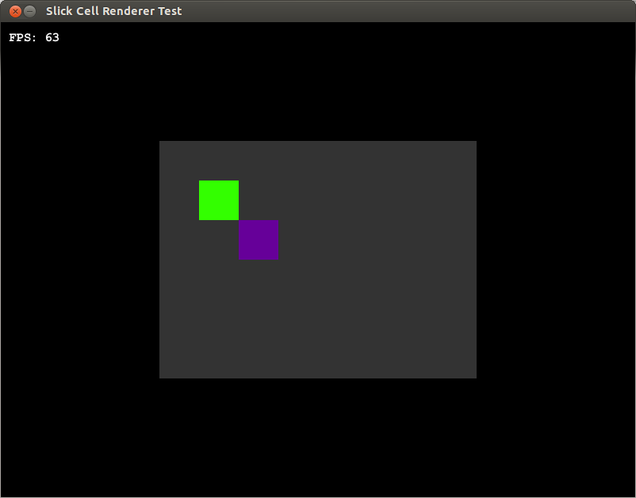

Provides a Java cell API to display fancy cell boxes. This API is library independent, therefore you have to draw everything by yourself. 

The following features can be used:

* Detection if position is inside of the box
* Pixel size and amount can be changed
* Images can be loaded
* Color detection

The following libraries are automatically supported:

* Slick2D

### Example

A short example in Slick2D. The following code:

```java
acid = new Acid(new SlickCellRenderer());
		acid.backgroundColor(0.2f, 0.2f, 0.2f);
		acid.setIndexX(8);
		acid.setIndexY(6);
		acid.setCellSize(50);
		
		acid.color(0.2f, 1f, 0f);
		acid.set(1, 1);
		acid.color(0.4f, 0f, 0.6f);
		acid.set(2, 2);
		
		// Set the element to the middle
		acid.setPosition(gc.getWidth() / 2f - acid.getWidth() / 2f, 
						 gc.getHeight() / 2f - acid.getHeight() / 2f);
```

creates the following result:


